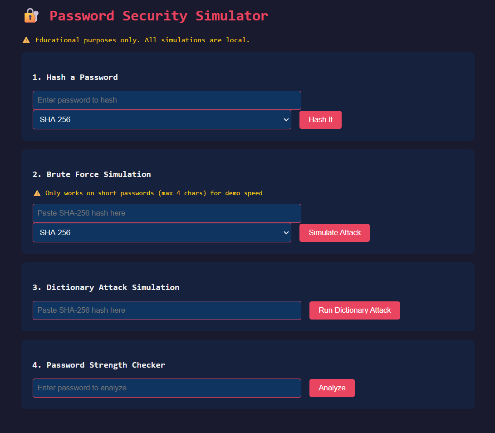
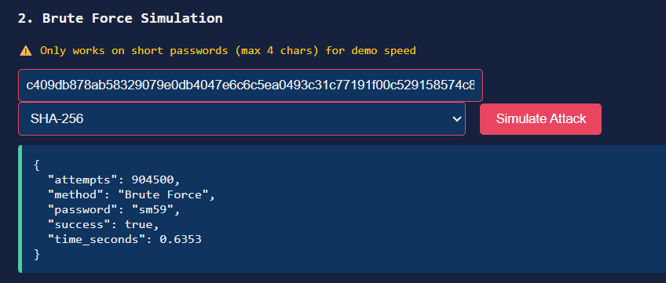
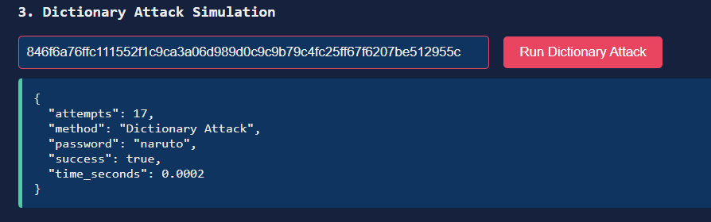
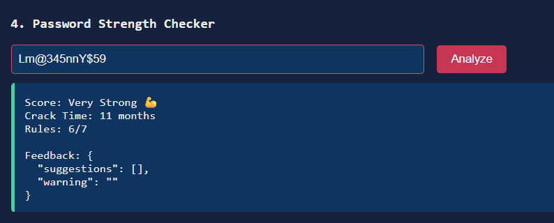

# 🔐 Password Cracking Simulator

An educational cybersecurity project that demonstrates how password attacks work — built for learning purposes only.


---

## ⚠️ Disclaimer

This project is strictly for **educational purposes**.  
All simulations run **locally only** — no real systems are targeted.  
Unauthorized access to computer systems is illegal.

---

## 📌 What This Project Does

This tool simulates how password-based attacks work so that  
developers and students can understand cybersecurity concepts hands-on.

| Feature | Description |
|---|---|
| 🔑 Password Hashing | Hash passwords using MD5, SHA-256, or bcrypt |
| 💥 Brute Force Attack | Try every combination to crack a hash |
| 📖 Dictionary Attack | Try common passwords from a wordlist |
| 🛡️ Strength Checker | Analyze how strong a password really is |
| ⏱️ Crack Time Estimator | Estimate how long cracking would take |

---

## 🧠 What You Will Learn

- Why passwords are stored as hashes — never plain text
- How brute force and dictionary attacks work
- Why bcrypt is safer than MD5 and SHA-256
- What makes a password truly strong
- How salting defeats rainbow table attacks

---

## 🛠️ Tech Stack

| Technology | Purpose |
|---|---|
| Python 3.x | Core language |
| Flask | Web framework |
| hashlib | MD5 and SHA-256 hashing |
| bcrypt | Secure password hashing |
| zxcvbn | Password strength estimation |
| HTML/CSS/JS | Frontend interface |

---

## 📁 Project Structure
```
password_simulator/
│
├── app.py                    ← Flask application entry point
├── requirements.txt          ← Python dependencies
├── README.md                 ← You are here!
│
├── modules/
│   ├── hasher.py             ← Hashing functions (MD5, SHA-256, bcrypt)
│   ├── brute_force.py        ← Brute force simulation
│   ├── dictionary_attack.py  ← Dictionary attack simulation
│   └── strength_checker.py   ← Password strength analysis
│
├── data/
│   └── wordlist.txt          ← Common passwords wordlist
│
├── templates/
│   └── index.html            ← Web UI
│
└── static/
    └── style.css             ← Styling
```

---

## 🚀 How To Run

### 1. Clone the repository
```bash
git clone https://github.com/YOUR_USERNAME/password-cracking-simulator.git
cd password-cracking-simulator
```

### 2. Create virtual environment
```bash
python -m venv venv
venv\Scripts\activate        # Windows
source venv/bin/activate     # Mac/Linux
```

### 3. Install dependencies
```bash
pip install -r requirements.txt
```

### 4. Run the application
```bash
python app.py
```

### 5. Open in browser
```
http://127.0.0.1:5000
```

---

## 📸 Screenshots

### Homepage


### Brute Force Result


### Dictionary Attack Result


### Password Strength Checker


---

## 🔍 How It Works

### Hashing
```
"hello" → SHA-256 → "2cf24dba5fb0a30e26e83b2ac5b9e29e..."
```
Passwords are never stored as plain text.  
Hashing is a one-way function — you cannot reverse it.

### Brute Force
```
Try: aa → ab → ac → ... → zz → aaa → aab → ...
Hash each → compare to target hash → match = cracked!
```

### Dictionary Attack
```
Try: password → dragon → sunshine → admin → ...
Hash each → compare to target hash → match = cracked!
```

### Why bcrypt Wins
```
MD5    speed: ~10 billion/sec  ← cracked in seconds
SHA256 speed: ~3  billion/sec  ← cracked in minutes  
bcrypt speed: ~10 thousand/sec ← cracked in centuries
```

---

## 📊 Example Output
```json
{
  "success": true,
  "password": "abc",
  "attempts": 731,
  "time_seconds": 0.0021,
  "method": "Brute Force"
}
```

---

## 🔒 Security & Ethics

- ✅ Runs on localhost only
- ✅ No external connections
- ✅ Uses small demo wordlist only
- ✅ No real credentials stored
- ❌ Do NOT use on real systems
- ❌ Do NOT target others' passwords

---

## 🚀 Future Improvements

- [ ] Add rainbow table demonstration
- [ ] Visualize crack time with charts
- [ ] Add hybrid attack mode
- [ ] Add real-time progress bar
- [ ] Compare more hashing algorithms

---


